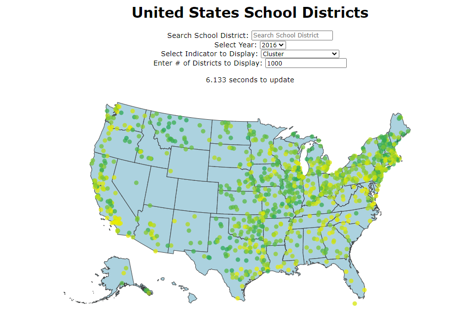

# School District Clustering

### Description

This program consists of three parts:

* **[Data Pipeline]:** A start-to-finish data pipeline that processes U.S. school district data into an ML-friendly format (`src/data`)

* **[School District Clustering]:** A clustering script that labels similar school districts (`src/features` and `src/models`)

* **[Choropleth]:** An interactive map that can be used to visualize the data (`src/visualization`)


### Installation

Using a Linux system with Python 3.x installed, type `make all` into the terminal.

```bash
$ make all
```

***Warning: This process requires a significant amount of memory (~16 GB). If you see "segmentation error" in the output, you may need to close some applications on your system and try again.***

### Execution

Using a Linux system with Python 3.x installed, type `make visual` into the terminal.

```bash
$ make visual
```

Then, using a web browser of your choice, navigate to http://localhost:8000/interactive.html




### Video Demo

A video walkthrough of this process can be found [here](https://youtu.be/RAWda3Gr9kk).


### Other Useful Information

--------
##### Project Organization

    ├── LICENSE
    ├── Makefile           <- Makefile with commands like `make data` or `make train`
    ├── README.md          <- The top-level README for developers using this project.
    ├── data
    │   ├── external       <- Data from third party sources.
    │   ├── interim        <- Intermediate data that has been transformed.
    │   ├── processed      <- The final, canonical data sets for modeling.
    │   └── raw            <- The original, immutable data dump.
    │
    ├── notebooks          <- Jupyter notebooks. Naming convention is a number (for ordering),
    │                         the creator's initials, and a short `-` delimited description, e.g.
    │                         `1.0-jqp-initial-data-exploration`.
    │
    ├── references         <- Data dictionaries, manuals, and all other explanatory materials.
    │
    ├── requirements.txt   <- The requirements file for reproducing the analysis environment, e.g.
    │                         generated with `pip freeze > requirements.txt`
    │
    ├── setup.py           <- makes project pip installable (pip install -e .) so src can be imported
    └── src                <- Source code for use in this project.
        ├── __init__.py    <- Makes src a Python module
        │
        ├── data           <- Scripts to download or generate data
        │
        ├── features       <- Scripts to turn raw data into features for modeling
        │
        ├── models         <- Scripts to train models and then use trained models to make
        │                     predictions
        │
        └── visualization  <- Scripts to create exploratory and results oriented visualizations


--------


##### Data Documentation

https://educationdata.urban.org/documentation/school-districts.html#overview


##### Cookiecutter Data Science Template

<p><small>Project based on the <a target="_blank" href="https://drivendata.github.io/cookiecutter-data-science/">cookiecutter data science project template</a>. #cookiecutterdatascience</small></p>
